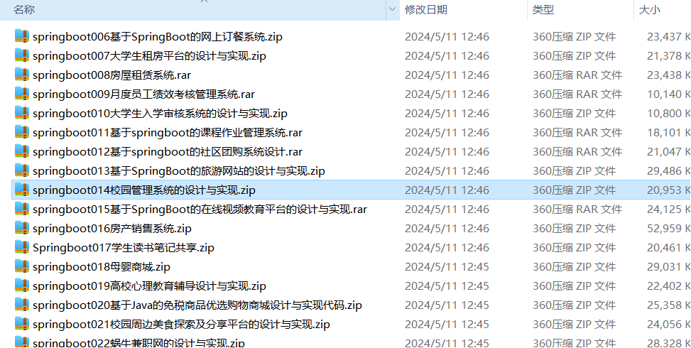

# springboot_course_travel_community_buying_school_online_education
📦 **SpringBoot多功能项目仓库** 🎯

本仓库汇集了五个基于 **Spring Boot** 的高实用性项目，适用于学习、开发实践和功能拓展！🚀

📚 **课程作业管理系统** —— 支持作业发布、在线提交、教师批改、成绩管理，助力高校课程管理高效化 🎓✅

🌍 **旅游网站系统** —— 集成景点推荐、行程规划、酒店预订、订单管理，打造智能化旅游服务平台 🏕️📅

🛒 **社区团购系统** —— 提供商品管理、拼团购买、订单处理、支付结算，实现高效社区电商运营 🏡🛍️

🏫 **校园管理系统** —— 具备学生信息管理、考勤记录、课程安排、宿舍管理等功能，助力校园数字化 🏢📖

🎥 **在线视频教育平台** —— 支持在线课程、视频学习、考试测评、学习进度跟踪，提升远程教育体验 📺📚

所有项目均基于 **Spring Boot** 构建，结合 **MySQL、Redis、Vue.js** 等技术，具备良好的扩展性和实用性。欢迎 **Star & Fork**，一起交流学习！🚀

项目部署说明✨：

推荐使用：谷歌浏览器

后台地址😎
http://localhost:8080/springboot/admin/dist/index.html

管理员  abo 密码 abo

前台地址😎

http://localhost:8080/springboot/front/index.html

在src\main\resources\application.yml中编辑数据库配置🎉										
url: jdbc:mysql://127.0.0.1:3306/springboot?useUnicode=true&characterEncoding=utf-8&useJDBCCompliantTimezoneShift=true&useLegacyDatetimeCode=false&serverTimezone=UTC
username: root
password: 123456

文档预览👀

其他项目合集✨

